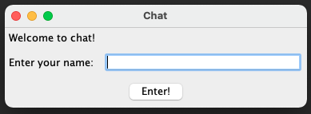
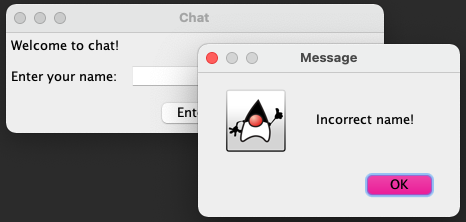
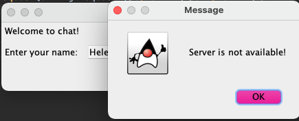
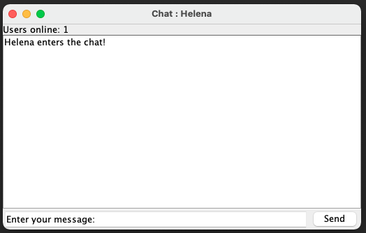
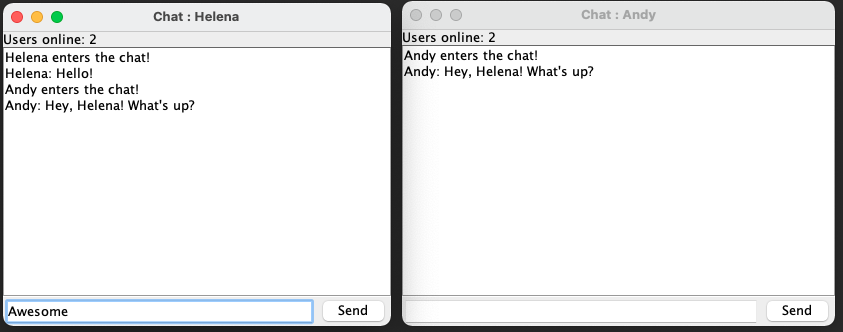
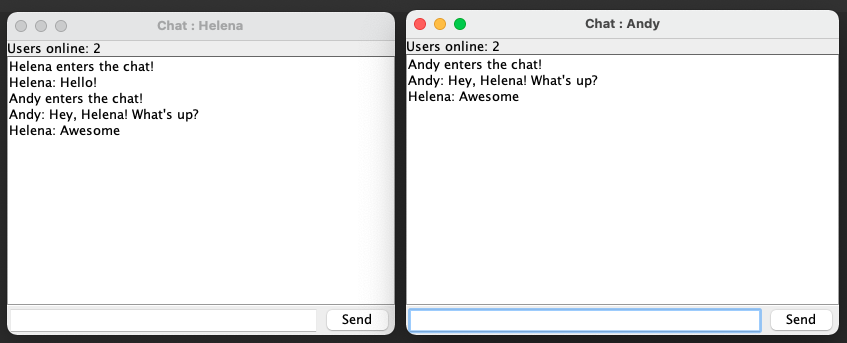
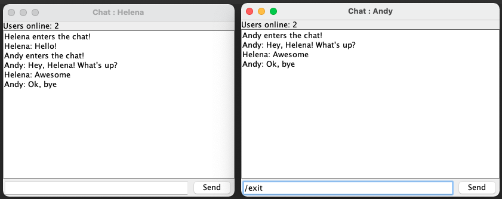
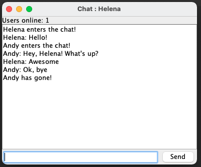

# Курсовой проект "Сетевой чат" - клиентская часть

## Особенности реализации:
- **Параметры подключения и работы клиента устанавливаются файлом конфигурации:**

  см. [settings.conf](src/main/resources/settings.conf);

- **На клиенте реализован простой интерфейс:**
  
    интерфейс реализован на основе класса JFrame,
  
    интерефейс клиента включает два основных окна: [окно входа и ввода имени пользователя](src/main/java/client/EnterWindow.java) и [окно сетевого чата](src/main/java/client/ClientWindow.java) - 

    см. [Скриншоты](#screenshots);
- **Для подключения к чату пользователь указывает своё имя:**
  
    вход в чат без указания имени невозможен - пользователю выводится [сообщение об ошибке](#incorrectNameError),

    вход в чат при недоступности сервера невозможен - пользователю выводится [сообщение об ошибке](#serverError),
    
    всем участникам чата отправляется сообщение о подключении пользователя,
  
    имя пользователя отображается в заголовке [окна сетевого чата](#chat) -

  см. [Скриншоты](#enter);

- **Для выхода из чата нужно отправить серверу (в чат) команду _“/exit”_:**
  
    закрытие окна чата также приводит к выходу,
    
    всем участникам чата отправляется сообщение о выходе пользователя - 

    см. [Скриншоты](#exit);
  
- **В окне чата всегда отображается количество подключенных пользователей:**

    см. [Скриншоты](#chat);
- **На клиенте реализовано логирование:**

    логируются все операции (уровень DEBUG) и ошибки (уровень ERROR) сервера посредством log4j,

    запись лога осуществляется в [client.log](log/client.log),

    в исходном варианте запись логов DEBUG и ERROR отключена [настройками](src/main/resources/log4j.properties);
- **Ведется запись всех отправленных в чат сообщений:**

    в записях фиксируется имя пользователя и время отправки,

    запись ведется посредством механизма логирования (уровень INFO);
- **При реализации использовался сборщик пакетов maven:**

    см. [pom.xml](pom.xml);
- **Код покрыт unit-тестами:**

    классы тестов реализованы в [src/test/java/client](src/test/java/client),
    
    _*unit-тесты для ui практически не писались в целях экономии времени, тк исходная задача не предполагала реализацию интерфейса_

_Код и описание серверной части проекта можно найти [здесь](https://github.com/agapovaelyne/java-hw-ChatServer)_

<a name="screenshots"><h2>Скриншоты</h2></a>

<b name="enter">Enter Window:</b>

<b name="incorrectNameError">Incorrect (empty) name error message:</b>

<b name="serverError">Server is not available error message:</b>

<b name="chat">Chat Window:</b>

<b>Chatting:</b>

↓

<b name="exit">Exit Command:</b>

<b>'User has gone' message:</b>

